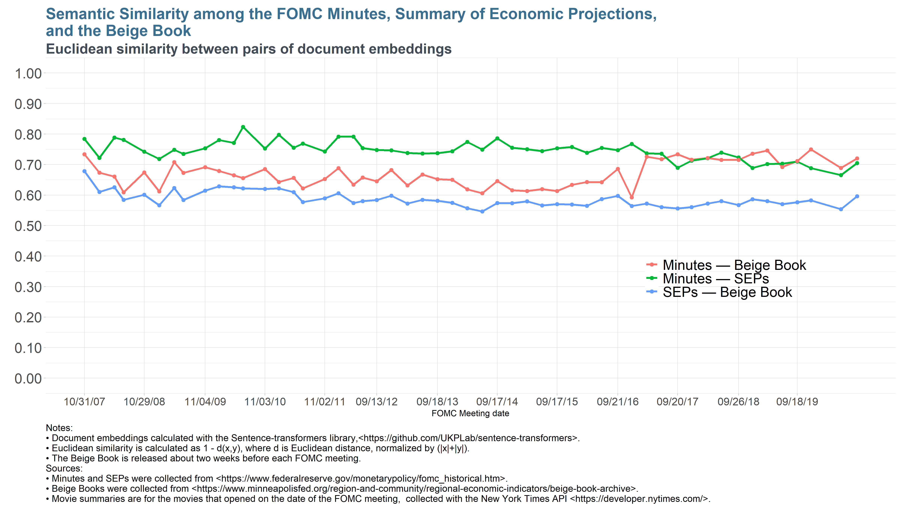

# Similarity between the FOMC minutes and the Summary of Economic Projections 

Rubén Hernández Murillo
October 2020.

## Summary

We strip the text of the FOMC participants' discussion on the outlook and their forecasts and 
calculate various measures of the semantic similarity with the FOMC participants' discussion of their forecast in the 
Summary of Economic Projections.
The similarity measures calculated here provide a notion of the correlation of ideas across the two documents.

## Methodology: Text similarity between documents

We calculate vector _embeddings_ of documents. An _embedding_ is a representation of a text in a dense vector space (a numeric vector in a high-dimensional space). 

We use the python library [`sentence-transformers`](https://github.com/UKPLab/sentence-transformers) which uses embeddings with BERT with PyTorch. 
Documentation: <https://www.sbert.net/>

## Alternative measures of similarity

We calculate three alternative measures
+ _Cosine similarity_: is the cosine of the angle formed by a pair of vectors. 
  It is a measure in (0,1) with larger numbers indicating a smaller angle (more similarity) as the vectors point in a similar direction.
+ _Pearson correlation_: this is the correlation coefficient of the elements of the vectors representing each document.
+ _Euclidean similarity_: this is calculated as $1 - d(x,y)$, where $d(x,y)$ is the Euclidean distance normalized by the sum of the norms of the vectors, $(|x| + |y|)$ to scale the distance to the interval $(0,1)$. 

## Results

### The Federal Reserve documents (Minutes, SEPs, Beige Book) exhibit a large degree of similarity among them.

1. The FOMC Minutes and SEPs exhibit the largest similarity for most of the period (2007--2016).
2. For comparison, the similarity between the SEPs and the National Summary of the Beige Book 
is much smaller. 
3. The similarity between the Minutes and the Beige Book is also smaller between 2007 and late 2016.
4. Interestingly, since 2017, the similarity between the Minutes and the Beige Book appears to be
comparable to the similarity between the Minutes and the SEPs.  
   Around this time, there was a significant revamping in the writing style of the National Summary of the Beige Book. The length was shortened and its sections were standardized. 
5. The ranking in terms of degree of similarity among the Federal Reserve documents were comparable across measures of similarity.

### Robustness checks

We added a fourth type of document to the comparison to verify that the similarity measures indeed capture related topics among the Federal Reserve Documents. 
Using the New York Times API, we downloaded the movie summaries of movies that opened on the date of the FOMC meeting for each issue of the Minutes, SEPs, and Beige Book. We then calculated the similarity between the movie summaries and each of the Federal Reserve documents.
As expected, the degree of similarity with movie summaries is much lower.

Interestingly, the highest similarity among the Federal Reserve Documents and the movie summaries was with the Beige Book (prior to 2017). This is reasonable since the language of the Beige Book was intended to be more colloquial prior to its 2017 redesign.

## Replication steps

1. Download data: 
    + [`R/download_fomc_minutes.R`](R/download_fomc_minutes.R) 
    + [`R/select_minutes_with_sep.R`](R/select_minutes_with_sep.R) 
    + [`R/download_beige_book.R`](R/download_beige_book.R)
    + [`R/download_and_process_movies.R`](R/download_and_process_movies.R)
2. Sign up for [Google Cloud Computing Services](https://cloud.google.com/).
    + Upload PDFs in [`data/minutes_sep_pdf.7z`](data/minutes_sep_pdf.7z) to a storage bucket.
    + Activate the [Vision AI](https://cloud.google.com/vision) API.
3. Create a python environment using:
    + [`python/requirements.txt`](python/requirements.txt)
4. Interact with the Vision API using 
    + [`code/gcompfiles.sh`](code/gcompfiles.sh)
5. Process OCR results: 
    + [`python/Process_ocr_results.ipynb`](python/Process_ocr_results.ipynb)
6. Prepare data for analysis:
    + [`R/organize_paragraphs.R`](R/organize_paragraphs.R)
    + [`R/organize_beige_book.R`](R/organize_beige_book.R)
7. Calculate embeddings and similarity measures:
    + [`python/Calculate_similarities.ipynb`](python/Calculate_similarities.ipynb)
8. Generate chart
    + [`R/plot_results.R`](R/plot_results.R)
9. Results:
    + [`data/data-gen/output_json.7z`](data/data-gen/output_json.7z)
    + [`data/data-gen/big_df.p`](data/data-gen/big_df.p)
    + [`data/data-gen/sent_minutes.p`](data/data-gen/sent_minutes.p)
    + [`data/data-gen/sent_seps.p`](data/data-gen/sent_seps.p)
    + [`data/data-gen/sent_beigebook.p`](data/data-gen/sent_beigebook.p)
    + [`data/data-gen/sent_movies.p`](data/data-gen/sent_movies.p)
    + [`data/data-gen/df_cosine.p`](data/data-gen/df_cosine.p)
    + [`data/data-gen/df_euclid.p`](data/data-gen/df_euclid.p)
    + [`data/data-gen/df_pearsn.p`](data/data-gen/df_pearsn.p)
10. Data:
    + [`data/minutes_sep_pdf.7z`](data/minutes_sep_pdf.7z)
    + [`data/beige_book_html.7z`](data/beige_book_html.7z)

  
## Attributions

+ We followed this project <https://github.com/kazunori279/pdf2audiobook> in using Google's 
[`Cloud Vision AI`](https://cloud.google.com/vision) to OCR the PDFs of the Minutes/SEPs. 
 This process provides detailed information on the location and size
 of the text in the PDF file used to strip the relevant paragraphs.
